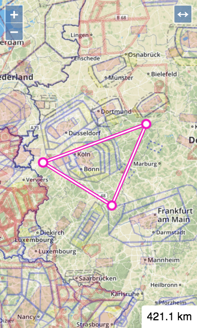

OpenFlightPlanner
==============================================================================

Flight planning tool for glider pilots

Live version at <https://turbo87.github.io/open-flight-planner/>

Development
------------------------------------------------------------------------------

Install gulp (build tool):

    npm install -g gulp

Install project dependencies:

    npm install

Run the development server (`out/dev/`):

    gulp serve

Run the production build (`out/prod/`):

    NODE_ENV=production gulp

License
------------------------------------------------------------------------------

OpenFlightPlanner is free software, and may be redistributed under the
[MIT license](LICENSE).
